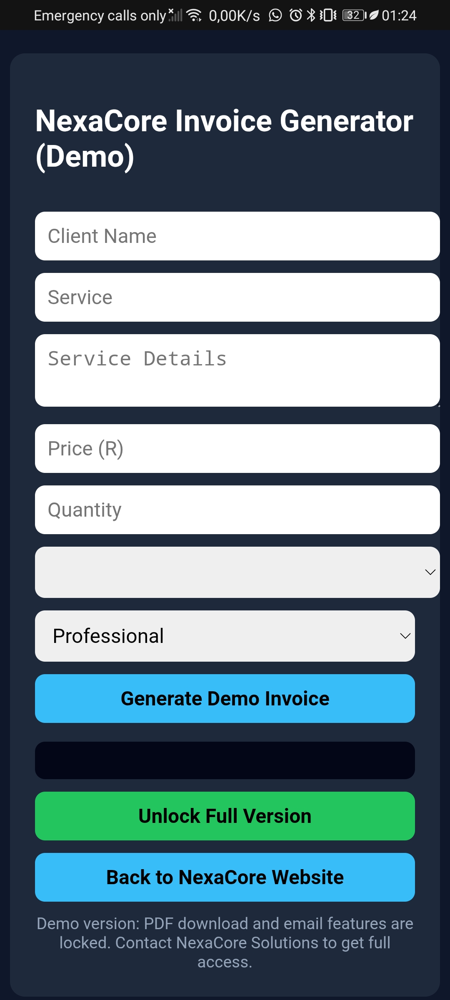

# NexaCore Invoice Generator (Demo)

A simple and efficient web-based invoice generator designed for small businesses, freelancers, and service providers.

This demo allows users to quickly generate professional invoice descriptions in seconds.

---

## 🚀 Live Demo
👉 https://selby-dev.github.io/nexacore-invoice-demo/

---

## 🎥 Demo Video

> *(Upload your video to GitHub or use a link like YouTube)*

---

## 🖼️ Screenshots

### 🔹 Invoice Generator Interface

---

## 💡 Features (Demo Version)

- Generate clean and professional invoice descriptions
- Supports:
  - Client name
  - Service type
  - Service details
  - Pricing and quantity
  - Date selection
- Multiple writing tones:
  - Professional
  - Simple
  - Detailed
- Instant output preview

---

## ⚠️ Demo Limitations

This is a **limited demo version**.

The following features are locked:
- ❌ PDF download
- ❌ Email sending
- ❌ Unlimited invoice generation

To unlock full functionality, contact NexaCore Solutions.

---

## 🛠️ Technologies Used

- HTML5  
- CSS3  
- JavaScript (Vanilla)

---

## 💼 Full Version

The full version includes:
- PDF invoice generation  
- Email integration  
- Unlimited usage  
- Enhanced business features  

📩 Contact: nexacore.solutions.sa@gmail.com

---

## 🌐 About NexaCore Solutions

NexaCore Solutions provides:
- Website development  
- Technical support  
- Computer repair services  
- Business solutions  

---

## 📌 Author

Developed by NexaCore Solutions
